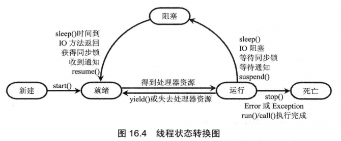

Java多线程
=============

几乎所有的操作系统都支持同时运行多个任务，一个任务通常是一个程序，每个运行中的程序就是一个进程。当一个程序运行时，内部可能包含了多个顺序执行流，每个顺序执行流就是一个线程。


现代操作系统多支持多进程并发：
  + 共用式多任务操作策略，例如Windows 3.1和Mac OS 9
  + 抢占式多任务操作策略：例如Windows NT、Windows 2000以及UNIX和Linux（此方式效率高，是主流）

+ 进程（Process）：当一个程序进入内存运行时，即变成一个进程。进程是处于运行过程中当程序，进程是系统进行资源分配和调度的一个独立单位。
  + 独立性：可以拥有自己独立的资源，每个进程都拥有自己私有的地址空间。
  + 动态性：进程具有自己的生命周期和各种不同的状态，这和静态的程序是不同的。
  + 并发性：多个进程可以在单个处理器上并发执行，多个进程之间不会互相影响。
+ 线程（Thread）：每个顺序执行流就是一个线程。线程是进程的执行单位，线程在程序中是独立、并发的执行流。
  + 线程可以拥有自己的堆栈、程序计数器和局部变量，但不拥有系统资源，它与父进程但其他线程共享该进程所拥有的全部资源。要确保线程不会妨碍同一进程里的其他线程。
  + 线程的执行是抢占式的
  + 线程是独立运行的，它并不知道进程中是否还有其他线程的存在。
  + 一个线程可以创建和撤销另一个线程
  + 线程的调度和管理由进程本身完成
  

线程创建的三种方式
===============

+ 继承Thread类
  + 特点：
    + 多个线程间无法共享线程类的实例变量
  + 代码：
  ```java
  /**
   * @author Chris Chen
   * @date 2019/4/25 下午3:54
   */
  public class FirstThread extends Thread{
      private int i;
  
      @Override
      public void run(){
          for (; i< 100; i++){
              System.out.println(getName() + " " + i);
          }
      }
  
      public static void main(String[] args) {
          for (int i=0; i<100; i++){
              System.out.println(Thread.currentThread() + " " + i);
              if (i == 20 ){
                  new FirstThread().start();
                  new FirstThread().start();
              }
          }
      }
  }

  ```
+ 实现Runnable接口
  + 特点：
    + 共享线程类的实例变量
    + Runnable接口是函数式接口（Java 8）
    + Thread类的作用就是把run()方法包装成线程执行体
  + 代码：
  ```java
  /**
   * @author Chris Chen
   * @date 2019/4/26 下午3:41
   */
  public class SecondThread implements Runnable{
      private int i;
  
      @Override
      public void run(){
          for (; i<100; i++){
              System.out.println(Thread.currentThread().getName() + " " + i);
          }
      }
  
      public static void main(String[] args) {
  
          SecondThread secondThread = new SecondThread();
          for (int i=0; i< 100; i++){
              System.out.println(Thread.currentThread().getName() + " " + i);
              if(i==20){
                  new Thread(secondThread, "newThread1").start();
                  new Thread(secondThread, "newThread2").start();
  
              }
          }
      }
  }

  ```
  + 匿名内部类写法：
  ```java
  /**
   * @author Chris Chen
   * @date 2019/4/27 上午9:16
   */
  public class SecondThread2 {
      public static void main(String[] args) {
          
          Runnable runnable = new Runnable() {
              public int i;
              @Override
              public void run() {
                  for (;i<100;i++){
                      System.out.println(Thread.currentThread().getName()+": "+i);
                  }
              }
          };
          
          for(int i=0; i<100;i++){
              System.out.println(Thread.currentThread().getName()+": "+i);
              if(i==20){
                  
                  new Thread(runnable, "newThread-1").start();
                  new Thread(runnable, "newThread-2").start();
              }
          }
      }
  }

  ```
  + lambda表达式写法(和前两种方法对比，无法写实现Runnable接口的类的实例变量)：
  ```java
  /**
   * @author Chris Chen
   * @date 2019/4/27 上午9:25
   */
  
  public class SecondThread3 {
      public static void main(String[] args) {
          /*
           无法在实现Runnable接口的类里增加实例变量，因此没有所谓共享线程类的实例变量
           */
          Runnable runnable = () -> {
              for (int j = 0; j < 100; j++) {
                  System.out.println(Thread.currentThread().getName() + ": " + j);
              }
          };
  
          for (int i = 0; i < 100; i++) {
              System.out.println(Thread.currentThread().getName() + ": " + i);
              if (i == 20) {
                  new Thread(runnable, "newThread-1").start();
                  new Thread(runnable, "newThread-2").start();
              }
          }
      }
  }

  ```
+ 使用Callable和Future（Runnable接口的增强版）
  + 特点： 
    + Future接口代表call()方法的返回值
  + 代码：
  ```java
  import java.util.concurrent.Callable;
  import java.util.concurrent.ExecutionException;
  import java.util.concurrent.FutureTask;
  
  /**
   * @author Chris Chen
   * @date 2019/4/27 上午10:26
   */
  public class ThirdThread implements Callable<Integer> {
      //public int i = 0;
  
      @Override
      public Integer call() throws Exception {
          int i = 0;
          for (; i < 100; i++) {
              System.out.println(Thread.currentThread().getName() + ": " + i);
          }
          return i;
      }
  
      public static void main(String[] args) {
  
          Callable<Integer> callable = new ThirdThread();
          FutureTask<Integer> futureTask = new FutureTask<Integer>(callable);
  
          for (int i = 0; i < 100; i++) {
              System.out.println(Thread.currentThread().getName() + " 的循环变量i的值: " + i);
              if (i == 20) {
                  new Thread(futureTask, "有返回值的线程").start();
              }
          }
  
          try {
              /*
              futureTask.get()会导致主线程被阻塞，直到call()方法结束并返回为止
              */
              System.out.println(futureTask.get());
          } catch (InterruptedException e) {
              e.printStackTrace();
          } catch (ExecutionException e) {
              e.printStackTrace();
          }
  
      }
  }

  ```
  + 匿名内部类写法：
  ```java
  import java.util.concurrent.Callable;
  import java.util.concurrent.ExecutionException;
  import java.util.concurrent.FutureTask;
  
  /**
   * @author Chris Chen
   * @date 2019/4/27 上午10:26
   */
  public class ThirdThread2 {
  
      public static void main(String[] args) {
          Callable<Integer> callable = new Callable<Integer>() {
              @Override
              public Integer call() throws Exception {
                  int i=0;
                  for (; i < 100; i++){
                      System.out.println(Thread.currentThread().getName() + ": "+ i);
                  }
                  return i;
              }
          };
  
          FutureTask<Integer> futureTask = new FutureTask<Integer>(callable);
  
          for (int i=0; i<100; i++){
              System.out.println(Thread.currentThread().getName() + " 的循环变量i的值: " + i);
              if(i==20){
                  new Thread(futureTask, "有返回值的线程").start();
              }
          }
          
          try {
              System.out.println(futureTask.get());
          } catch (InterruptedException e) {
              e.printStackTrace();
          } catch (ExecutionException e) {
              e.printStackTrace();
          }
  
      }
  }

  ```
  + lambda表达式写法：
  ```java
  import java.util.concurrent.Callable;
  import java.util.concurrent.ExecutionException;
  import java.util.concurrent.FutureTask;
  
  /**
   * @author Chris Chen
   * @date 2019/4/26 下午4:12
   */
  public class ThirdThread3 {
      public static void main(String[] args) {
  //        ThirdThread thirdThread = new ThirdThread();
  
          FutureTask<Integer> task = new FutureTask<Integer>((Callable<Integer>)() ->{
              int i=0;
              for (; i< 100; i++){
                  System.out.println(Thread.currentThread().getName() + " " + i);
              }
              return i;
          } );
  
          for (int i=0; i<100; i++){
              System.out.println(Thread.currentThread().getName() + " 的循环变量i的值: " + i);
              if(i==20){
                  new Thread(task, "有返回值的线程").start();
              }
          }
          try {
              System.out.println("子线程的返回值：" + task.get());
          } catch (Exception e){
              e.printStackTrace();
          }
      }
  }

  ```
  + **小结**
    + 实现Runnable接口和使用Callable和Future方式下，多线程可以共享同一个target对象。
    + 不要显示创建线程，请使用线程池。
    线程资源必须通过线程池提供，不允许在应用中自行显式创建线程。 
    说明：使用线程池的好处是减少在创建和销毁线程上所花的时间以及系统资源的开销，解决资源不足的问题。如果不使用线程池，有可能造成系统创建大量同类线程而导致消耗完内存或者“过度切换”的问题。

线程的生命周期
==============

+ 线程状态转换图  

+ 新建状态：
  + 使用new关键字创建了一个线程后，该线程就处于新建状态
  + JVM为其分配内存、并初始化成员变量的值
+ 就绪状态：
  + JVM为其创建方法调用栈和程序计数器
+ 运行状态：
  + 对于抢占式策略的系统而言，系统会给每个可执行的线程一个小时间段来处理任务；当该时间段用完以后，系统就会剥夺该线程所占用的资源，让其他线程获得执行的机会，在选择下一个线程时，系统会考虑线程的优先级。
  + 对于协作式调度策略的系统而言，必须主动放弃所占用的资源（调用线程的sleep()或yield()方法）。
+ 阻塞状态：
  + 线程调用了一个阻塞式IO方法，在该方法返回之前，该线程被阻塞
  + suspend()方法不建议使用，容易导致死锁
+ 死亡状态：
  + stop()方法不建议使用，容易导致死锁

控制线程
========
+ join线程
  + 让一个线程等待另一个线程完成的方法-main线程调用了jt线程的join()方法，那么main线程必须等待jt线程执行结束才会向下执行
+ 后台线程
  + 调用Thread对象的setDaemon()方法可以将指定线程设置成后台线程，setDaemon(true)必须在start()方法之前调用
  + 如果所有的前台线程都死亡，那么后台线程会自动死亡
+ 线程睡眠
+ 线程让步
  + 通常不建议使用yield()方法来控制并发线程的执行
+ 改变线程优先级
  + 每个线程默认的优先级和创建它的父线程的优先级相同
  + Thread类提供了setPriority()方法来设置指定线程的优先级
  + 尽量使用三个静态常量来设置优先级，以保证有最好的可移植性

线程同步
==================
+ 线程安全：
  + 银行取钱问题：
    + 用户输入账号、密码，系统判断用户的账号、密码是否匹配
    + 用户输入取款金额
    + 系统判断账户余额是否大于取款金额
    + 如果余额大于取款金额，则取款成功；否则失败
  + 代码：
    + 账号信息：  
    ```java
    package com.chris.threadsecurity;
    
    /**
     * @author Chris Chen
     * @date 2019/4/28 上午10:04
     */
    public class Account {
    
        private String accountNo;
        private double balance;
    
        public Account(String accountNo, double balance) {
            this.accountNo = accountNo;
            this.balance = balance;
        }
    
        public String getAccountNo() {
            return accountNo;
        }
    
        public void setAccountNo(String accountNo) {
            this.accountNo = accountNo;
        }
    
        public double getBalance() {
            return balance;
        }
    
        public void setBalance(double balance) {
            this.balance = balance;
        }
    
        @Override
        public boolean equals(Object obj){
            if(this == obj){
                return true;
            }
            if(obj != null && obj.getClass() == Account.class){
                Account target = (Account) obj;
                return target.getAccountNo().equals(accountNo);
            }
            return false;
        }
    
        @Override
        public int hashCode(){
            return accountNo.hashCode();
        }
    }

    ```
    + 取钱线程：
    ```java
    package com.chris.threadsecurity;
    
    /**
     * @author Chris Chen
     * @date 2019/4/28 上午10:20
     */
    public class DrawThread extends Thread {
        /**
         account: 模拟用户账户
         drawAmount: 当前取钱线程所希望取的钱数
         */
        private Account account;
        private double drawAmount;
    
        public DrawThread(String name, Account account, double drawAmount){
            super(name);
            this.account = account;
            this.drawAmount = drawAmount;
        }
    
        @Override
        public void run(){
            /*
            如果余额大于取钱数目
             */
            if(account.getBalance() >= drawAmount){
                /*
                吐出钞票
                 */
                System.out.println(getName() + "取钱成功！吐出钞票：" + drawAmount);
                /*
                修改余额
                 */
                account.setBalance(account.getBalance() - drawAmount);
                System.out.println("\t余额为：" + account.getBalance());
            }else {
                System.out.println(getName() + "取钱失败！余额不足！");
            }
    
        }
    
    }

    ```
    + 主程序：
    ```java
    package com.chris.threadsecurity;
    
    /**
     * @author Chris Chen
     * @date 2019/4/28 上午10:34
     */
    public class DrawTest {
        public static void main(String[] args) {
            /*
            创建一个账户
             */
            Account account = new Account("1234567", 1000);
            new DrawThread("甲", account, 800).start();
            new DrawThread("乙", account, 800).start();
        }
    }

    ```